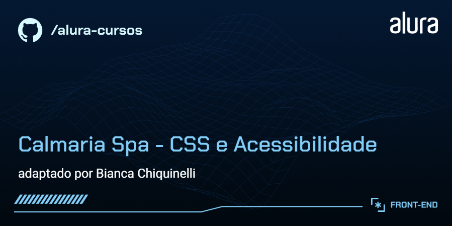

# Calmaria Spa

Estrutura inicial do projeto criada a partir do curso "CSS: ajustando a acessibilidade visual em um projeto" da Alura e evoluído com os cursos "Acessibilidade no HTML: escrevendo códigos semânticos para inclusão" e "Acessibilidade Web: manipulando WAI-ARIA e elementos interativos com Javascript". A Calmaria Spa é um empresa fictícia de bem estar e saúde. e este projeto representa a landing page do site, focada em oferecer uma experiência inclusiva para todas as pessoas usuárias.

## 🔨 Funcionalidades do projeto

Durante o curso, nos análisamos e refatoramos o código do projeto.
O desafio é encontrar pontos de melhoria para tornar o projeto Calmaria Spa acessível para todas as pessoas usuárias.

`Menu interativo`: com submenu acessível, permitindo navegação por teclado.
`Modais acessíveis`: para inscrição e contato, com gerenciamento de foco (loop de Tab e Shift+Tab) e fechamento via tecla Escape.
`Acordeões interativos`: com suporte a ARIA, garantindo que o conteúdo possa ser expandido e recolhido com acessibilidade.
`Suporte a foco visível`: para navegação por teclado.
`Gerenciamento de navegação`: para evitar perda de contexto ao interagir com elementos modais.

O [Figma dessa aplicação você encontra aqui](https://www.figma.com/file/1pDTUXo7ovT6zlE64Zw509/Calmaria-Spa--%7C-Forma%C3%A7%C3%A3o-Acessibilidade?type=design&node-id=98-1263&mode=design&t=iIe3hZrzPEvVEi0o-0).

## ✔️ Técnicas e tecnologias utilizadas

🧪 Tecnologias:

- `HTML` para estrutura e estilização.
- `CSS` para manipulação de interatividade e acessibilidade.
- `Figma` para referência de layout e design.
<!-- - `Módulos JavaScript` (import/export) para organização do código. -->

⚙️ Técnicas e Funcionalidades Aplicadas:

- `HTML semântico` para melhorar a estrutura e usabilidade com leitores de tela.
- `Diretrizes WCAG` aplicadas para atender aos padrões de acessibilidade digital.
- `WAI-ARIA` para enriquecer a experiência de usuários com tecnologias assistivas.
- `Unidades relativas` (em, rem, clamp()) para adaptação visual em diferentes configurações.
- `Testes de acessibilidade` com ferramentas automatizadas e leitores de tela.

## 🛠️ Abrir e rodar o projeto

Para abrir e rodar o projeto, utilize um editor de código de sua escolha.

Depois, abra o projeto no seu navegador.

Você também pode acessar a [Calmaria Spa através deste link](https://calmaria-spa-seven-eta.vercel.app/)
